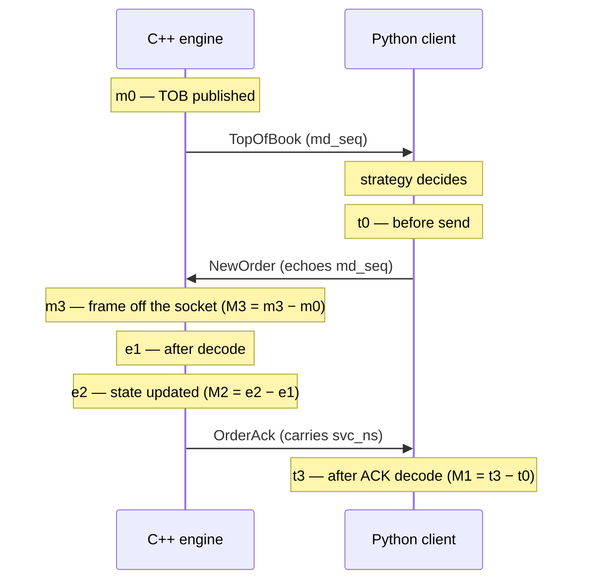
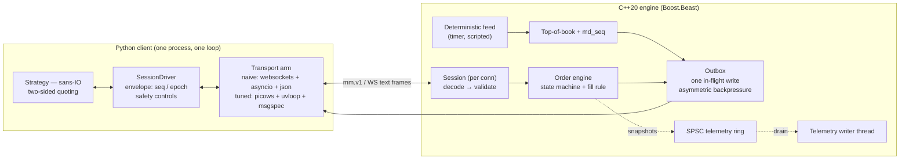

# Mock market-making engine (C++20) + market-making client (Python)

A mock exchange and a market-making client, built to be measured. The engine publishes top of book
and matches orders over a WebSocket; the client quotes two-sided at the touch, re-quotes on book
moves, restores its quote after fills, and stops quoting when data goes stale.

The optimization under measurement is a **whole-stack swap** on both sides of the wire —
`websockets + asyncio + stdlib json + nlohmann` → `picows + uvloop + msgspec + glaze` — with the
same engine binary, the same protocol, the same strategy core and the same safety controls in both
arms.

---

## Results

Full method, tables, bands and limits: **[`docs/BENCHMARK.md`](docs/BENCHMARK.md)**. Ranked next
steps: **[`docs/OPTIMIZATION.md`](docs/OPTIMIZATION.md)**. Wire contract:
**[`docs/PROTOCOL.md`](docs/PROTOCOL.md)**.

All figures below are from the authoritative in-container run `run 20260730T220711Z`:
46 runs after a discarded burn-in, 10k warm-up + 100k samples each, 7 interleaved repeats per
cell, native arm64, zero rejects. A pre-registered peer audit excluded 2 disturbed repeats; the
verdict is unchanged with them included (`docs/BENCHMARK.md` §9).

### Quote reaction — `m0 → m3`, tick to order (the headline)

The engine publishes a book at `m0`; the client decides and sends an order echoing that `md_seq`;
the engine receives it at `m3`. Single-process C++ measurement, decomposed:

| arm | m0→m0' (venue production) | m0'→m3 (delivery + reaction) | **m0→m3 total** | p99.9 |
|---|---:|---:|---:|---:|
| naive | 1.2 µs | 200.8 µs | **202.3 µs** | 850.1 µs |
| **tuned** | 1.0 µs | 148.1 µs | **149.2 µs** | 667.4 µs |

Venue production is unchanged — nothing in the swap touches it — so **the entire 53.1 µs
improvement is in delivery and reaction**, which is the part that would transfer to a real gateway.

### Order round trip — `M1`, client-observable

| arm | p50 | p90 | p99 | p99.9 |
|---|---:|---:|---:|---:|
| naive | 88.4 µs | 98.7 µs | 126.2 µs | 182.1 µs |
| **tuned** | **58.2 µs** | 66.2 µs | 83.9 µs | **134.9 µs** |

Every naive/tuned band is **disjoint**: the worst tuned repeat beats the best naive repeat in every
comparison in the matrix.

### Throughput

| arm | 1 kHz | 5 kHz | 10 kHz |
|---|---|---|---|
| naive | sustained (lag ~473 µs, flat) | **saturated** (lag 466 µs, 46% CPU) | **saturated** (lag 490 µs, 72% CPU) |
| tuned | sustained | sustained (lag 1.6 µs, 100% CPU) | sustained (lag 1.8 µs, 100% CPU) |

The naive arm's send lag is **rate-independent at ~0.5 ms** — it is latency-bound on per-message
overhead, not compute-bound, so more cores would not help it. The tuned arm holds 10 kHz and *is*
compute-bound at one full core.

### Engine service time — `M2`

**~1 µs in every scenario**, against an end-to-end of 40–170 µs. The C++ order-matching path was
never the bottleneck; see `docs/OPTIMIZATION.md` for why that ranks transport ahead of engine work.

---

## Measurement model

Three intervals, each entirely inside one process — no cross-process clock arithmetic:



M1 is client-observable round trip (`perf_counter_ns`), M2 engine service time, M3 tick-to-order
(both `steady_clock`). Under paced load the harness additionally records CO-corrected
(`done − intended`), actual-send and lag series separately — coordinated omission is measured,
not argued about.

## Architecture



Everything above the transport adapter is shared between the two arms. That is what makes the
measured delta attributable to the stack rather than to a behaviour change.

## Threading and ownership model

**The complete thread inventory is two threads.** Not "about two" — two.

| thread | owns | never touches |
|---|---|---|
| **owner thread** | the `io_context`, every `Session`, the order book, all order state, all counters | the telemetry file |
| **telemetry writer** | the telemetry file handle and its own buffer | any engine state |

The boundary between them is a **single-producer/single-consumer ring**. The owner thread pushes
snapshots; the writer drains them. Nothing else crosses.

**Why the counters need no atomics.** They are written by exactly one thread and read by exactly
one thread, through the ring — so there is no shared mutable state to protect. Adding atomics would
buy nothing and cost a fence on the measured path.

**Restraint here is a decision, not an absence.** The designed promotion — should it ever be needed
— is a dedicated order-state thread behind an SPSC queue, with the **measured promotion trigger**: the
engine's CPU share stays at 8.8–21.5% across every scenario measured (see the manifests), so a
second thread would add a queue hop to a path that is not CPU-starved. It is specified and not
built, on evidence.

**ThreadSanitizer, host, full suite:**

```
100% tests passed out of 179
Total Test time (real) = 108.87 sec
```

One caveat recorded rather than hidden: test 153 (`server: each OrderAck carries the svc_ns of the
command that COST it`) failed once in three full TSan runs while the host was loaded by unrelated
containers, and passes in isolation. Its own comments describe why it is timing-sensitive — it must
stall the write loop with 4 KiB socket buffers so two acks queue before either pops — and under
TSan instrumentation plus competing load that recipe can fail to produce the stall. Container TSan
has never been green; recorded here honestly rather than claimed.

## Observability design

- **Single-writer counters**, as above: no atomics, no locks, no contention on the measured path.
- **Bounded ring with drop-and-count.** When the telemetry ring is full it drops and increments a
  counter. Blocking the measured path to write a diagnostic would corrupt the thing being
  diagnosed.
- **1 Hz snapshots** of the counter set, plus optional per-message events.
- **Per-message logging is disabled under measurement**, and the run manifest records that it was
  (`per_message_logging: false`) — so a reader can tell whether the numbers were taken with it on.

## Safety controls

| control | mechanism | enforced by | proven by |
|---|---|---|---|
| Max live orders | `max_live_orders = 2`; a third is `reject{MaxLiveOrders}` | **engine** (client also self-limits) | `cpp/tests/`, and the bench probe is designed never to trip it |
| Max order quantity | `qty` bounds → `reject{QtyLimit}` | **engine** | `cpp/tests/` |
| Tick / lot conformance | `px % tick_size`, `qty % lot_size` → `reject{TickSize}` / `{LotSize}` | **engine** | `cpp/tests/`; caught a real harness bug (`qty=1` vs `lot_size=10`) |
| Post-only (no aggressive fills) | crossing on arrival → `reject{PostOnlyCross}` | **engine** | `cpp/tests/` |
| Duplicate client id | `reject{DupClOrdId}` | **engine** | `cpp/tests/` |
| Stale market data | client stops quoting past `--stale-ms`, cancels, closes 4000 | **client** | `python/tests/`, and step 7 of the demo |
| Sequence integrity | envelope `seq` contiguous from 1; a gap closes 1002 | **both** | `python/tests/`, `cpp/tests/` |
| Cancel-on-disconnect | engine cancels the session's resting orders | **engine** | `cpp/tests/`, and the reconnect step of the demo |
| Report backpressure | report HWM breach closes 1008 rather than dropping reports | **engine** | `cpp/tests/` |
| Market-data backpressure | conflate to newest; `md_seq` gaps | **engine** | `cpp/tests/` |
| Message size cap | 64 KiB after reassembly → `MsgTooLarge` / close 1009 | **both** | `cpp/tests/`, `python/tests/` |

## Assumptions

1. **The book is exogenous.** The published top of book never reflects the strategy's own orders,
   so quoting at the touch is not self-referential and every fill is feed-driven.
2. **Cancel-on-disconnect** is the outstanding-order policy, so a reconnect starts flat by
   construction and there is no reconciliation path.
3. **Loopback, single machine.** No network fabric, no multi-host clock question.
4. **Fixed quote quantity.** The strategy quotes a configured size; sizing logic is out of scope.
5. **One symbol.** `MOCKUSDT` throughout.

---

## Build, test, run

### Native

```bash
make fast          # default: dev C++ suite + Python suite, both freshly built
make check         # full host gate: lint, mypy, format, 4-preset ctest matrix, coverage, docs
make perf          # the wall-clock-calibrated suite (excluded from correctness gates by design)
```

### Container (authoritative)

```bash
make verify-linux                      # builds the pinned image and runs the whole gate in it
make verify-linux PLATFORM=linux/amd64 # amd64 smoke under emulation (not valid for timing)
```

### Demo — the seven-step demo script

```bash
scripts/demo.sh            # tuned arm
MM_STACK=naive scripts/demo.sh
```

Prints each of the seven steps with a PASS/FAIL verdict read from telemetry. The same checkpoints
are asserted as a test in `python/tests/test_integration_demo.py`, so the demo cannot rot quietly.

### Benchmark

```bash
# The full benchmark matrix, in the pinned image (native arch — emulated timing is meaningless).
docker run --rm --cpus 8 --memory 10g \
  -e MM_IMAGE_DIGEST="$(docker inspect --format '{{.Id}}' mm-engine-verify:aarch64)" \
  -v "$PWD/bench/results:/work/bench/results" mm-engine-verify:aarch64 \
  bash -lc 'cd /work && ./scripts/run_bench.sh 3 100000 10000'

# Summarise one run, including its benchmark primary-table verdict:
PYTHONPATH=bench .venv/bin/python -m harness.summarize \
  --rtt bench/results/<stamp>/<run>.rtt.i64 \
  --actual bench/results/<stamp>/<run>.actual.i64 \
  --lag bench/results/<stamp>/<run>.lag.i64 \
  --engine bench/results/<stamp>/<run>.engine.bench \
  --warmup 10000 --require-samples 100000 --mode <idle|react|paced> --rate 1000 --md

scripts/profile.sh   # the in-container flamegraph
```

### CI

A minimal GitHub Actions job runs `scripts/verify_linux.sh` on native amd64. `verify_linux.sh` is
also the local entry point, so CI and a developer run the same gate rather than two similar ones.

---

## Skill map

| surface | shipped artifact | proven by |
|---|---|---|
| C++ concurrency & ownership | single owner thread, per-session strand, SPSC telemetry ring | TSan suite; `cpp/tests/` |
| Lock-free / memory ordering | SPSC ring with acquire/release pairing | `cpp/tests/test_bench_recorder.cpp`, TSan |
| Network / WebSocket protocol | Boost.Beast session, `mm.v1`, close-code discipline, reassembly caps | `cpp/tests/`, `docs/PROTOCOL.md` |
| Latency measurement method | M1/M2/M3, CO correction, exact-rank percentiles, primary-table gate | `bench/harness/`, `python/tests/test_harness_sanity.py` |
| Market-making domain | two-sided quoting at the touch, post-only, stale-data withdrawal, cancel-on-disconnect | `python/mmclient/strategy.py`, seven-step demo test |
| Python performance | picows + uvloop + msgspec arm, measured against the stdlib arm | `docs/BENCHMARK.md` |
| Systems profiling | in-container `perf` capture, collapse, and a gate that fails an unsymbolised profile | `scripts/profile.sh` |
| Build / reproducibility | pinned image, tree-sha label gate, per-run manifests with binary sha256 | `scripts/verify_linux.sh`, `bench/harness/manifest.py` |

The **msgpack** and **WS-over-UDS** arms are **proposed and evidence-graded, not implemented** —
see `docs/OPTIMIZATION.md` #2 and #3.

---

## Known limitations

1. **arm64, not x86-64.** All authoritative numbers are native aarch64 in a container on Apple
   silicon. **No claim is made about `rdtsc`, `PAUSE`, or any x86-specific timing or spin
   primitive** — none is used, and none was measured.
2. **Container VM, uncontrolled CPU governor.** The host governor is not readable inside the VM,
   and frequency scaling moves p99 more than most optimizations do. This is why every figure is
   reported with a run-to-run band.
3. **glaze needs C++23** for its one translation unit; the engine core is C++20-clean. `yyjson`
   (C++20) is the recorded fallback behind a 30-minute timebox.
4. **Single-core throughput ceiling.** The tuned client is at 100% of one core at 5 kHz and still
   sustains 10 kHz; beyond that it needs a second process or the shared-memory transport.
5. **`orders_` grows by ~1 retained entry per order for the session's lifetime.** This is the
   documented allocation exception: order history is retained so that a late cancel or a duplicate
   id can be answered correctly rather than guessed at.
6. **The amd64 path is emulation-smoke-tested only**, which is unfit for timing.
7. **Profiling on Docker Desktop needs `--privileged`** — the kernel-symbol sysctl is
   VM-global; `scripts/profile.sh` gates on an unsymbolised profile instead of shipping one.
8. **The two client arms diverge at the raw WebSocket framing edge** — invalid UTF-8, non-canonical
   payload lengths, close-code legality, CLOSE during fragmentation. None is reachable through
   `mm.v1` traffic (each needs a hand-built frame neither client emits), and the engine is the
   strictest of the three implementations, so nothing reaches order state. But it means a
   conformance suite written against one arm would not transfer unchanged to the other. Tabulated
   in `docs/PROTOCOL.md` §8.5b; closing it means patching third-party parsers.
9. **Counter exhaustion is undefined** — `seq`/`md_seq`/`epoch` wrap in C++ and raise in Python.
   Reaching it needs ~1.8×10¹⁹ messages (~58 million years at 10 kHz), so no guard sits on the
   measured path; `docs/PROTOCOL.md` §7.1 says so rather than implying it is handled.
10. **Container TSan has never been green** — recorded honestly rather than claimed.

## Roadmap

**Next, in order:** **fund the shared-memory ring through its promotion gate** — take
a symbolised profile, confirm the ≥50% kernel/transport attribution, then build the ring with its
tear-injection suite. Second, the **WS-over-UDS arm** (~1 h), which is the cheapest way to turn the
inference about transport into a measurement. Third, a **clock-identity proof**, which would let M1
split into one-way `t0→e1` and `e2→t3` legs and locate the remaining ~58 µs far more precisely than
anything else available — and which is measurement, not optimization, so it carries no production
risk at all.
