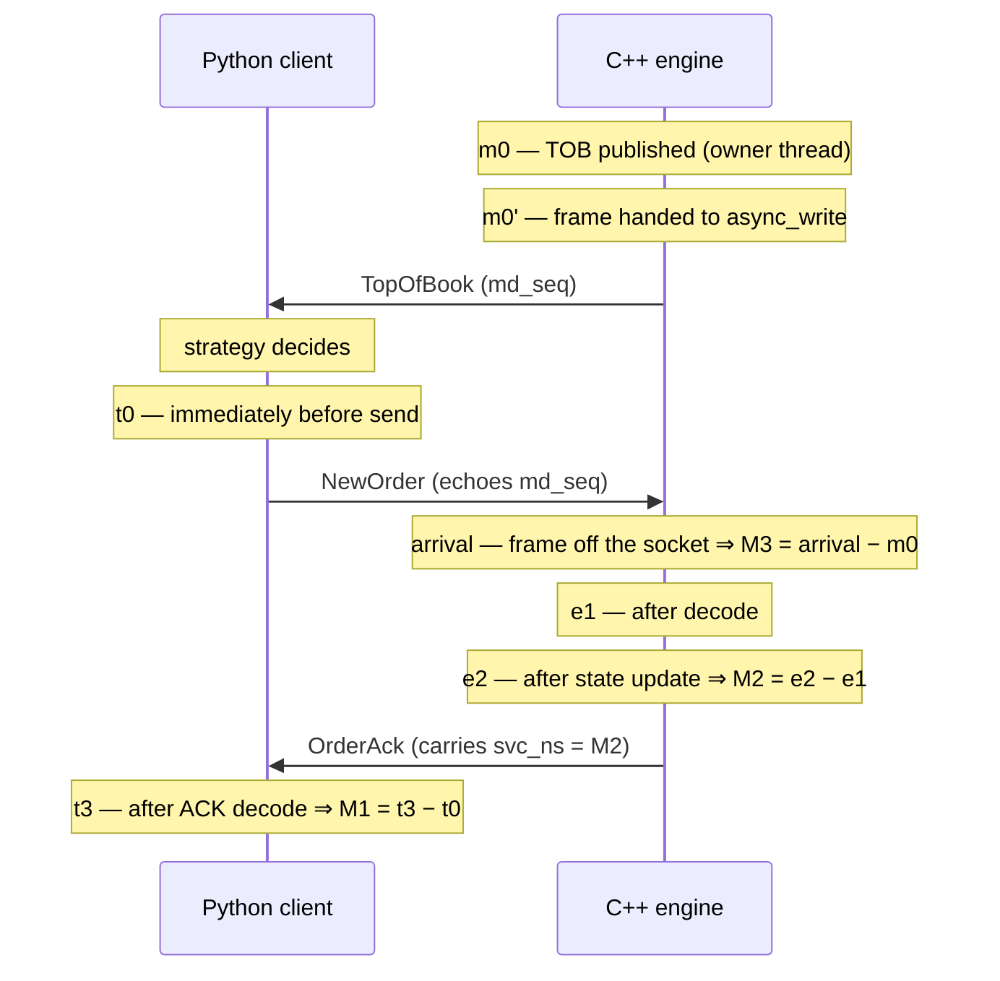

# BENCHMARK — the §5.2 measurement, its method, and what it does and does not establish

Authoritative run: `bench/results/20260730T220711Z` — 46 runs taken after a discarded burn-in
cycle: 42 primaries (7 repeats × 6 cells) plus 4 non-primary saturation probes. A pre-registered
peer audit (`scripts/bench_peer_audit.py`) excluded 2 of the 42 primaries for anomalous outlier
clustering against their siblings; the 40 published runs all qualify under the §5.2 gate
(`rejects = 0`, engine recorder refused 0, no send-stream gaps). Every raw `.i64` series, every
engine dump and every per-run manifest — **including the two excluded runs** — is committed
alongside this document. §9 discloses the exclusions and shows the verdict is insensitive to them.

**The headline, stated once and precisely.** Swapping the whole client/engine stack —
`websockets + asyncio + stdlib json + nlohmann` → `picows + uvloop + msgspec + glaze` — moved the
client-observable order round trip from **88.4 µs to 58.2 µs at p50**, and the
tick-to-order loop from **202.3 µs to 149.2 µs at p50**. Under 1 kHz paced load the
CO-corrected p50 moved from 639.6 µs to 39.6 µs, which is mostly a statement about
schedule adherence rather than service latency — §5 explains why, and it is the most misreadable
number in this document.

---

## 1. What was measured, and where the clocks sit

Three intervals, each **entirely within one process**, so nothing here requires two processes to
share a clock origin. That is a §2.1 requirement, not a convenience, and §7 returns to it.



| Id | Interval | Domain | What it isolates |
|---|---|---|---|
| **M1** | Python `t0` pre-send → `t3` post-ACK-decode | Python | Full client-observable round trip |
| **M2** | C++ `e1` **post-decode** → `e2` post-state-update | C++ | Engine service time |
| **M3** | C++ `m0` TOB publish → `m3` receipt of the `NewOrder` echoing that `md_seq` | C++ | Tick-to-order |

**Why M2 begins after decode and M3 ends at arrival, which are deliberately different rules.**
§5.1 specifies `e1` "after message decode", so M2 excludes the JSON parse: decode is the work the
codec swap changes, and including it would make M2 partly a measurement of the decoder rather than
of engine handling. M3 is the opposite case — the reaction *ended* when the order reached the
engine, and decode is genuinely part of the tick-to-order path a venue would feel — so `m3` is the
socket-arrival stamp. Both stamps are taken from the same frame; only one of them moves.

This was wrong until late in the project: a single arrival stamp served both, so M2 silently
absorbed decode plus the sequence and epoch checks. Every M2 figure below is from the corrected
boundary.

## 2. Protocol

- ≥10,000 warm-up cycles discarded, ≥100,000 samples retained, per run.
- **7 repeats, interleaved A,B,A,B,…** — not all-A-then-all-B. Running one arm to completion and
  then the other makes the comparison hostage to anything that drifts across the pass; alternating
  puts both arms on both sides of every drift. The spec floor is 3 repeats; 7 exist so that
  excluding a disturbed repeat (two bullets down) still leaves well above that floor.
- **A discarded burn-in cycle precedes the matrix** — one short run whose results directory is
  deleted before the first counted run starts. A freshly started container measurably perturbs its
  first minutes (three 3-repeat matrices in a row each lost an early repeat to it); the burn-in
  absorbs that settling without touching any published number.
- **A post-hoc peer audit gates publication** (`scripts/bench_peer_audit.py`). Each repeat is
  compared to its siblings on two signals independent of the latency being published: wall-clock
  more than 10% above the peer median, and >5 ms outlier count above max(20, 2× peer median) with
  excess ≥ 20. A flagged repeat is excluded, never repaired; thresholds were calibrated and
  falsified in both directions before this matrix ran (§9).
- Warm-up dropped **by count**, not by elapsed time, because the engine's own streams carry no
  timestamps to filter on and client and engine cycles correspond 1:1 in idle and react.
- Percentiles are **exact ranks on the sorted data**: index `ceil(p·n) − 1`, never interpolated. An
  interpolated p99 is a value no request experienced.
- Engine `--bench-out` on; per-message logging off (the manifest records it).
- Every run restarts the engine on an ephemeral port, so no run inherits another's recorder state.
- **Both arms disable Nagle and refuse compression.** Stated rather than measured, and true by
  construction on both sides.

## 3. Environment

Captured per run in `<run>.manifest.json`. From the authoritative pass:

| field | value |
|---|---|
| CPU | `CPU implementer=0x61 CPU architecture=8 CPU variant=0x0 CPU part=0x000` |
| cores | 24 |
| OS / kernel | Linux 6.12.76-linuxkit / `#1 SMP Sat Jul 11 11:18:11 UTC 2026` |
| arch | aarch64 (native arm64 — **never emulated**) |
| CPU governor | not readable on this host — uncontrolled (see BENCHMARK.md methodology) |
| affinity | `0,1,2,3,4,5,6,7,8,9,10,11,12,13,14,15,16,17,18,19,20,21,22,23` |
| image digest | `sha256:872133da1a8f7cba2f82a2447d8cae1d830ae22732326a7fdf8717e8bd254b9a` |
| engine binary sha256 | `c5c5d4e057394aceac7d74cd1b7288e7a42c75c077936b6102eabc51605df3b1` |
| engine build | `compiler: GNU 15.2.0` / `build-type: Release` |
| Python | 3.14.4 (CPython) |

Two of these are load-bearing and were absent from an earlier pass. **`engine_sha256`** is the only
provenance field a reader can check — `engine_version` prints the same string for every rebuild
from the same source, so it cannot distinguish the binary that produced these numbers from a
different one built the same way. **`image_digest`** names the container. An earlier matrix was
taken inside an image built one commit behind the tree and nothing in its manifests recorded which
binary ran; the mismatch had to be reconstructed afterwards from image labels and commit
archaeology.

**The governor is not controlled**, and the field says so in words rather than being omitted. CPU
frequency scaling moves p99 more than most optimizations do. Inside a container VM the host
governor is not readable, so every number here carries that uncertainty; it is one reason the
run-to-run band matters more than any single figure.

## 4. Coordinated omission

A paced client that stalls and then catches up reports, if timed from the **actual** send, only its
service time: every request it managed to send looks fast, and the requests it never sent during
the stall are simply absent from the data. The queueing delay was real and was paid by whoever was
waiting — it just happened before the timer started.

So the harness records both, from the same cycles:

- **CO-corrected** (`done − intended`) — timed from when the request was *due*. This is the honest
  series and the one the primary tables use.
- **actual-send** (`done − sent`) — reported beside it so the gap is visible rather than argued
  about.
- **send lag** (`sent − intended`) — the queue proxy, which is what the correction is made of.

In idle and react the client is not paced, so `intended == sent` and the two series are identical —
which is why their lag tables are all zero and that is correct, not a bug. Under paced load they
diverge sharply, and §5 is about exactly that divergence.

**Lag below the pacing resolution is not a measurement.** The probe can only send when it wakes, so
the wake interval floors how precisely it can hit a slot. It is one tenth of a period, bounded to
[20 µs, 1 ms].

## 5. Primary tables

### 5.1 M1 — client-observable round trip, CO-corrected (µs)

| run | count | min | p50 | p90 | p99 | p99.9 | max |
|---|---:|---:|---:|---:|---:|---:|---:|
| `idle_naive_R1` | 100,000 | 33.1 | **82.4** | 95.0 | 116.5 | **174.2** | 1,073.1 |
| `idle_naive_R2` | 100,000 | 44.3 | **95.3** | 107.8 | 133.9 | **197.3** | 1,064.5 |
| `idle_naive_R3` | 100,000 | 37.6 | **88.0** | 98.7 | 126.2 | **182.1** | 903.1 |
| `idle_naive_R4` | 100,000 | 39.9 | **87.6** | 98.5 | 125.2 | **179.8** | 1,206.2 |
| `idle_naive_R5` | 100,000 | 37.4 | **88.4** | 98.7 | 129.6 | **189.7** | 2,836.8 |
| `idle_naive_R6` | 100,000 | 37.5 | **88.9** | 99.0 | 123.5 | **180.1** | 1,597.5 |
| `idle_naive_R7` | 100,000 | 41.7 | **93.2** | 105.7 | 136.2 | **191.7** | 665.5 |
| `idle_tuned_R1` | 100,000 | 19.2 | **57.7** | 66.0 | 81.8 | **134.9** | 928.6 |
| `idle_tuned_R2` | 100,000 | 19.3 | **57.4** | 65.4 | 82.6 | **133.1** | 264.7 |
| `idle_tuned_R3` | 100,000 | 19.8 | **58.6** | 66.5 | 84.6 | **135.9** | 1,141.8 |
| `idle_tuned_R4` | 100,000 | 19.1 | **58.2** | 66.2 | 85.5 | **134.4** | 729.3 |
| `idle_tuned_R5` | 100,000 | 19.4 | **58.8** | 66.6 | 84.9 | **136.4** | 866.7 |
| `idle_tuned_R6` | 100,000 | 18.9 | **58.2** | 66.2 | 83.9 | **132.8** | 399.0 |
| `idle_tuned_R7` | 100,000 | 14.2 | **57.8** | 65.9 | 81.4 | **134.9** | 668.1 |
| `react_naive_R1` | 100,000 | 71.3 | **169.4** | 269.6 | 574.0 | **863.5** | 21,486.4 |
| `react_naive_R2` | 100,000 | 76.0 | **171.5** | 239.1 | 525.4 | **764.9** | 9,263.0 |
| `react_naive_R3` | 100,000 | 73.6 | **170.8** | 242.0 | 526.7 | **730.2** | 9,111.2 |
| `react_naive_R4` | 100,000 | 76.4 | **170.5** | 235.8 | 508.2 | **724.4** | 7,630.3 |
| `react_naive_R5` | 100,000 | 76.8 | **173.8** | 241.4 | 512.2 | **754.8** | 15,729.2 |
| `react_naive_R6` | 100,000 | 78.8 | **171.8** | 237.0 | 517.4 | **760.5** | 20,011.9 |
| `react_naive_R7` | 100,000 | 75.0 | **169.4** | 235.7 | 516.1 | **741.5** | 16,857.6 |
| `react_tuned_R1` | 100,000 | 37.9 | **129.0** | 200.0 | 404.7 | **596.1** | 7,226.0 |
| `react_tuned_R2` | 100,000 | 36.9 | **128.2** | 193.7 | 389.8 | **573.8** | 20,208.1 |
| `react_tuned_R3` | 100,000 | 35.1 | **126.2** | 190.5 | 388.6 | **583.1** | 14,017.4 |
| `react_tuned_R4` | 100,000 | 37.6 | **129.8** | 196.8 | 391.8 | **558.0** | 13,648.2 |
| `react_tuned_R5` | 100,000 | 37.1 | **129.2** | 198.7 | 389.2 | **560.9** | 16,300.0 |
| `react_tuned_R6` | 100,000 | 37.2 | **128.3** | 202.2 | 408.5 | **604.1** | 16,646.0 |
| `react_tuned_R7` | 100,000 | 35.8 | **127.3** | 194.9 | 394.6 | **589.7** | 17,157.3 |
| `paced_naive_R2` | 100,000 | 73.4 | **712.0** | 1,295.2 | 1,566.4 | **1,950.3** | 2,736.5 |
| `paced_naive_R3` | 100,000 | 69.6 | **651.0** | 1,249.7 | 1,615.4 | **2,054.3** | 3,987.6 |
| `paced_naive_R4` | 100,000 | 63.0 | **635.8** | 1,251.8 | 1,530.2 | **2,021.3** | 6,103.6 |
| `paced_naive_R5` | 100,000 | 65.7 | **624.0** | 1,131.5 | 1,464.6 | **1,904.5** | 14,469.5 |
| `paced_naive_R7` | 100,000 | 87.2 | **639.6** | 1,242.5 | 1,527.6 | **2,018.7** | 8,487.2 |
| `paced_tuned_R1` | 100,000 | 18.6 | **39.3** | 46.8 | 88.1 | **201.8** | 2,560.7 |
| `paced_tuned_R2` | 100,000 | 19.5 | **39.6** | 47.3 | 90.3 | **184.3** | 1,347.2 |
| `paced_tuned_R3` | 100,000 | 19.2 | **39.6** | 47.1 | 88.1 | **177.4** | 2,063.1 |
| `paced_tuned_R4` | 100,000 | 20.1 | **39.8** | 47.2 | 86.4 | **176.3** | 2,129.4 |
| `paced_tuned_R5` | 100,000 | 18.4 | **39.2** | 46.8 | 86.8 | **193.0** | 1,174.8 |
| `paced_tuned_R6` | 100,000 | 18.5 | **39.6** | 47.0 | 86.2 | **203.8** | 2,588.1 |
| `paced_tuned_R7` | 100,000 | 18.7 | **39.8** | 47.9 | 91.7 | **203.6** | 1,993.5 |

### 5.2 The same runs, actual-send (µs) — identical to the above for idle and react by construction

| run | count | min | p50 | p90 | p99 | p99.9 | max |
|---|---:|---:|---:|---:|---:|---:|---:|
| `idle_naive_R1` | 100,000 | 33.1 | **82.4** | 95.0 | 116.5 | **174.2** | 1,073.1 |
| `idle_naive_R2` | 100,000 | 44.3 | **95.3** | 107.8 | 133.9 | **197.3** | 1,064.5 |
| `idle_naive_R3` | 100,000 | 37.6 | **88.0** | 98.7 | 126.2 | **182.1** | 903.1 |
| `idle_naive_R4` | 100,000 | 39.9 | **87.6** | 98.5 | 125.2 | **179.8** | 1,206.2 |
| `idle_naive_R5` | 100,000 | 37.4 | **88.4** | 98.7 | 129.6 | **189.7** | 2,836.8 |
| `idle_naive_R6` | 100,000 | 37.5 | **88.9** | 99.0 | 123.5 | **180.1** | 1,597.5 |
| `idle_naive_R7` | 100,000 | 41.7 | **93.2** | 105.7 | 136.2 | **191.7** | 665.5 |
| `idle_tuned_R1` | 100,000 | 19.2 | **57.7** | 66.0 | 81.8 | **134.9** | 928.6 |
| `idle_tuned_R2` | 100,000 | 19.3 | **57.4** | 65.4 | 82.6 | **133.1** | 264.7 |
| `idle_tuned_R3` | 100,000 | 19.8 | **58.6** | 66.5 | 84.6 | **135.9** | 1,141.8 |
| `idle_tuned_R4` | 100,000 | 19.1 | **58.2** | 66.2 | 85.5 | **134.4** | 729.3 |
| `idle_tuned_R5` | 100,000 | 19.4 | **58.8** | 66.6 | 84.9 | **136.4** | 866.7 |
| `idle_tuned_R6` | 100,000 | 18.9 | **58.2** | 66.2 | 83.9 | **132.8** | 399.0 |
| `idle_tuned_R7` | 100,000 | 14.2 | **57.8** | 65.9 | 81.4 | **134.9** | 668.1 |
| `react_naive_R1` | 100,000 | 71.3 | **169.4** | 269.6 | 574.0 | **863.5** | 21,486.4 |
| `react_naive_R2` | 100,000 | 76.0 | **171.5** | 239.1 | 525.4 | **764.9** | 9,263.0 |
| `react_naive_R3` | 100,000 | 73.6 | **170.8** | 242.0 | 526.7 | **730.2** | 9,111.2 |
| `react_naive_R4` | 100,000 | 76.4 | **170.5** | 235.8 | 508.2 | **724.4** | 7,630.3 |
| `react_naive_R5` | 100,000 | 76.8 | **173.8** | 241.4 | 512.2 | **754.8** | 15,729.2 |
| `react_naive_R6` | 100,000 | 78.8 | **171.8** | 237.0 | 517.4 | **760.5** | 20,011.9 |
| `react_naive_R7` | 100,000 | 75.0 | **169.4** | 235.7 | 516.1 | **741.5** | 16,857.6 |
| `react_tuned_R1` | 100,000 | 37.9 | **129.0** | 200.0 | 404.7 | **596.1** | 7,226.0 |
| `react_tuned_R2` | 100,000 | 36.9 | **128.2** | 193.7 | 389.8 | **573.8** | 20,208.1 |
| `react_tuned_R3` | 100,000 | 35.1 | **126.2** | 190.5 | 388.6 | **583.1** | 14,017.4 |
| `react_tuned_R4` | 100,000 | 37.6 | **129.8** | 196.8 | 391.8 | **558.0** | 13,648.2 |
| `react_tuned_R5` | 100,000 | 37.1 | **129.2** | 198.7 | 389.2 | **560.9** | 16,300.0 |
| `react_tuned_R6` | 100,000 | 37.2 | **128.3** | 202.2 | 408.5 | **604.1** | 16,646.0 |
| `react_tuned_R7` | 100,000 | 35.8 | **127.3** | 194.9 | 394.6 | **589.7** | 17,157.3 |
| `paced_naive_R2` | 100,000 | 58.9 | **163.1** | 220.5 | 394.0 | **647.8** | 1,472.7 |
| `paced_naive_R3` | 100,000 | 45.5 | **154.2** | 212.2 | 471.0 | **653.8** | 3,438.3 |
| `paced_naive_R4` | 100,000 | 50.8 | **155.8** | 211.2 | 445.8 | **666.7** | 3,818.3 |
| `paced_naive_R5` | 100,000 | 57.0 | **160.2** | 214.8 | 449.0 | **659.4** | 2,359.2 |
| `paced_naive_R7` | 100,000 | 58.5 | **163.9** | 221.3 | 441.1 | **670.0** | 3,145.3 |
| `paced_tuned_R1` | 100,000 | 17.7 | **37.8** | 44.9 | 85.8 | **185.2** | 2,560.5 |
| `paced_tuned_R2` | 100,000 | 18.3 | **38.1** | 45.4 | 87.9 | **177.3** | 1,347.1 |
| `paced_tuned_R3` | 100,000 | 18.0 | **38.0** | 45.2 | 85.9 | **170.5** | 2,062.2 |
| `paced_tuned_R4` | 100,000 | 18.8 | **38.3** | 45.3 | 84.0 | **166.8** | 2,129.2 |
| `paced_tuned_R5` | 100,000 | 17.8 | **37.8** | 44.8 | 84.6 | **181.0** | 1,172.8 |
| `paced_tuned_R6` | 100,000 | 18.0 | **38.1** | 45.1 | 83.9 | **194.1** | 2,587.6 |
| `paced_tuned_R7` | 100,000 | 18.1 | **38.1** | 46.0 | 89.0 | **193.3** | 1,992.6 |

### 5.3 naive vs tuned, medians of 7 (paced naive: 5) with min–max bands (µs)

| scenario | metric | naive median | naive band | tuned median | tuned band | gap | worst within-arm spread |
|---|---|---:|---|---:|---|---:|---:|
| idle | p50 | 88.4 | 82.4–95.3 | **58.2** | 57.4–58.8 | **30.2** | 13.0 |
| idle | p99.9 | 182.1 | 174.2–197.3 | **134.9** | 132.8–136.4 | **47.2** | 23.1 |
| react | p50 | 170.8 | 169.4–173.8 | **128.3** | 126.2–129.8 | **42.4** | 4.4 |
| react | p99.9 | 754.8 | 724.4–863.5 | **583.1** | 558.0–604.1 | **171.6** | 139.1 |
| paced | p50 | 639.6 | 624.0–712.0 | **39.6** | 39.2–39.8 | **600.0** | 88.0 |
| paced | p99.9 | 2,018.7 | 1,904.5–2,054.3 | **193.0** | 176.3–203.8 | **1,825.6** | 149.8 |

### 5.4 M2 — engine service time, post-decode → post-state-update (µs)

| run | count | min | p50 | p90 | p99 | p99.9 | max |
|---|---:|---:|---:|---:|---:|---:|---:|
| `idle_naive_R1` | 100,000 | 0.1 | **0.8** | 1.0 | 1.3 | **5.6** | 26.0 |
| `idle_naive_R2` | 100,000 | 0.1 | **1.0** | 1.2 | 1.5 | **7.1** | 29.0 |
| `idle_naive_R3` | 100,000 | 0.1 | **0.9** | 1.1 | 1.5 | **6.1** | 68.5 |
| `idle_naive_R4` | 100,000 | 0.1 | **0.8** | 1.0 | 1.3 | **5.0** | 54.3 |
| `idle_naive_R5` | 100,000 | 0.1 | **0.9** | 1.1 | 1.5 | **6.7** | 88.9 |
| `idle_naive_R6` | 100,000 | 0.1 | **1.0** | 1.1 | 1.4 | **5.5** | 23.2 |
| `idle_naive_R7` | 100,000 | 0.1 | **1.0** | 1.2 | 1.5 | **5.5** | 39.4 |
| `idle_tuned_R1` | 100,000 | 0.1 | **0.9** | 1.1 | 1.3 | **5.0** | 22.7 |
| `idle_tuned_R2` | 100,000 | 0.1 | **1.0** | 1.1 | 1.4 | **5.4** | 36.8 |
| `idle_tuned_R3` | 100,000 | 0.1 | **0.9** | 1.1 | 1.4 | **6.4** | 26.2 |
| `idle_tuned_R4` | 100,000 | 0.1 | **0.9** | 1.0 | 1.4 | **5.1** | 30.0 |
| `idle_tuned_R5` | 100,000 | 0.1 | **1.0** | 1.1 | 1.4 | **5.7** | 33.4 |
| `idle_tuned_R6` | 100,000 | 0.1 | **1.0** | 1.2 | 1.5 | **5.7** | 62.5 |
| `idle_tuned_R7` | 100,000 | 0.1 | **1.0** | 1.1 | 1.4 | **5.4** | 57.9 |
| `react_naive_R1` | 209,999 | 0.2 | **1.2** | 2.5 | 6.2 | **23.2** | 8,151.3 |
| `react_naive_R2` | 209,999 | 0.2 | **1.1** | 2.0 | 5.0 | **20.3** | 753.1 |
| `react_naive_R3` | 209,999 | 0.2 | **1.1** | 2.0 | 5.3 | **18.5** | 141.0 |
| `react_naive_R4` | 209,999 | 0.2 | **1.1** | 2.0 | 5.1 | **18.5** | 175.3 |
| `react_naive_R5` | 209,999 | 0.2 | **1.0** | 1.8 | 4.2 | **15.8** | 153.0 |
| `react_naive_R6` | 209,999 | 0.2 | **1.0** | 1.7 | 4.2 | **16.7** | 134.0 |
| `react_naive_R7` | 209,999 | 0.2 | **1.1** | 1.9 | 4.9 | **17.5** | 802.2 |
| `react_tuned_R1` | 209,999 | 0.2 | **1.3** | 2.7 | 6.6 | **25.6** | 422.8 |
| `react_tuned_R2` | 209,999 | 0.2 | **1.1** | 2.1 | 5.0 | **21.9** | 390.0 |
| `react_tuned_R3` | 209,999 | 0.2 | **1.1** | 2.2 | 5.0 | **21.5** | 207.9 |
| `react_tuned_R4` | 209,999 | 0.2 | **1.3** | 2.4 | 6.1 | **25.8** | 186.0 |
| `react_tuned_R5` | 209,999 | 0.2 | **1.3** | 2.5 | 5.6 | **25.7** | 178.5 |
| `react_tuned_R6` | 209,999 | 0.2 | **1.3** | 2.7 | 6.5 | **26.4** | 240.8 |
| `react_tuned_R7` | 209,999 | 0.2 | **1.3** | 2.5 | 6.2 | **24.5** | 132.9 |
| `paced_naive_R2` | 100,000 | 0.2 | **1.5** | 2.2 | 5.2 | **20.1** | 97.7 |
| `paced_naive_R3` | 100,000 | 0.2 | **1.5** | 2.2 | 5.2 | **16.5** | 77.8 |
| `paced_naive_R4` | 100,000 | 0.2 | **1.5** | 2.1 | 5.2 | **18.9** | 253.5 |
| `paced_naive_R5` | 100,000 | 0.2 | **1.7** | 2.4 | 6.1 | **21.8** | 72.0 |
| `paced_naive_R7` | 100,000 | 0.2 | **1.3** | 1.9 | 4.4 | **15.0** | 284.1 |
| `paced_tuned_R1` | 100,000 | 0.3 | **0.9** | 1.1 | 2.3 | **5.2** | 60.9 |
| `paced_tuned_R2` | 100,000 | 0.3 | **1.0** | 1.2 | 2.4 | **5.8** | 193.2 |
| `paced_tuned_R3` | 100,000 | 0.3 | **0.8** | 1.0 | 2.2 | **5.0** | 32.1 |
| `paced_tuned_R4` | 100,000 | 0.3 | **0.9** | 1.2 | 2.2 | **5.2** | 31.5 |
| `paced_tuned_R5` | 100,000 | 0.2 | **0.9** | 1.2 | 2.4 | **5.2** | 23.3 |
| `paced_tuned_R6` | 100,000 | 0.3 | **1.0** | 1.2 | 2.3 | **5.2** | 35.0 |
| `paced_tuned_R7` | 100,000 | 0.2 | **0.8** | 1.1 | 2.2 | **4.9** | 44.0 |

**M2 is ~1 µs in every scenario, against an end-to-end of 40–170 µs.** That is the single most
important structural fact in this document: the engine's **order-matching work** is roughly three
orders of magnitude smaller than the path around it.

**Read M2's boundaries before drawing the wider conclusion.** By §5.1's definition it starts after
decode and ends after the state update and response creation, so it excludes both the inbound JSON
parse and the outbound serialize-and-write completion. M2 is therefore *the matching kernel, not
the whole C++ data path* — the correct inference is "order matching is not where the time goes",
not "the C++ side is finished". Further optimization effort still belongs in transport and the
Python legs first, which is what §8's profile and OPTIMIZATION.md's ranking both point at.

### 5.5 M3 — tick-to-order, decomposed (react only) (µs)

React is the only mode whose engine-side `m0`/`m3` streams mean anything: idle echoes one stale
`md_seq` forever and paced measures its own pacing phase. The idle and paced rows are absent here
by design, not missing.

| run | count | min | p50 | p90 | p99 | p99.9 | max |
|---|---:|---:|---:|---:|---:|---:|---:|
| `react_naive_R1` | 100,000 | 72.9 | **200.7** | 326.4 | 646.2 | **934.2** | 21,246.8 |
| `react_naive_R2` | 100,000 | 82.7 | **203.0** | 275.3 | 599.2 | **850.1** | 8,194.2 |
| `react_naive_R3` | 100,000 | 82.1 | **202.7** | 277.1 | 607.2 | **858.9** | 9,934.6 |
| `react_naive_R4` | 100,000 | 81.4 | **201.3** | 270.6 | 584.7 | **839.1** | 13,562.0 |
| `react_naive_R5` | 100,000 | 81.1 | **205.7** | 278.5 | 590.6 | **850.7** | 15,448.9 |
| `react_naive_R6` | 100,000 | 85.1 | **202.3** | 272.7 | 595.5 | **845.1** | 18,873.8 |
| `react_naive_R7` | 100,000 | 74.9 | **199.3** | 270.3 | 588.6 | **848.0** | 16,999.5 |
| `react_tuned_R1` | 100,000 | 45.6 | **149.2** | 280.3 | 472.2 | **667.8** | 12,762.0 |
| `react_tuned_R2` | 100,000 | 52.3 | **149.9** | 267.9 | 458.0 | **667.4** | 19,231.4 |
| `react_tuned_R3` | 100,000 | 45.1 | **147.5** | 267.5 | 458.5 | **658.0** | 11,884.4 |
| `react_tuned_R4` | 100,000 | 52.2 | **151.5** | 272.0 | 457.7 | **651.8** | 16,633.7 |
| `react_tuned_R5` | 100,000 | 48.0 | **152.7** | 276.2 | 456.1 | **644.5** | 14,426.9 |
| `react_tuned_R6` | 100,000 | 49.2 | **149.2** | 287.0 | 477.9 | **673.6** | 17,127.9 |
| `react_tuned_R7` | 100,000 | 50.5 | **148.5** | 275.7 | 463.5 | **670.0** | 17,686.8 |

Decomposed, medians of 7 with bands:

| arm | m0→m0' (venue production) | m0'→m3 (delivery + reaction) | m0→m3 (total) |
|---|---:|---:|---:|
| naive | 1.2 | 200.8 | 202.3 |
| tuned | 1.0 | 148.1 | 149.2 |

**Venue production is unchanged at ~1 µs; the entire improvement is in delivery and reaction.** The
mock's own market-data production cost did not move, and nothing about the optimization was supposed
to move it — which is a useful negative result, because it means the tick-to-order win is not an
artifact of the simulator getting faster at talking to itself.

> **Attribution framing, verbatim as ratified:** *engine numbers characterize this mock's order
> path; transport and Python numbers transfer to a production gateway; venue-sim internals are
> reported but claim nothing.*

## 6. Secondary probes — the E-5 saturation question, labelled NON-PRIMARY

These answer "do queues build", not "what is p99". One run each, ≥20,000 samples. **No percentile
claim is made from them.**

| probe | client CPU | engine CPU | actual-send p50 | **send-lag p50** | period | verdict |
|---|---:|---:|---:|---:|---:|---|
| `paced_naive_P5000` | 45.5% | 12.3% | 107.3 | **466.1** | 200.0 | **SATURATED** |
| `paced_naive_P10000` | 71.9% | 19.7% | 87.4 | **490.0** | 100.0 | **SATURATED** |
| `paced_tuned_P5000` | 100.0% | 8.2% | 35.8 | **1.6** | 200.0 | sustained |
| `paced_tuned_P10000` | 100.3% | 15.3% | 35.3 | **1.8** | 100.0 | sustained |

**The reading, and the framing correction that matters most.** Put the naive arm's send lag
beside the period it was asked to hit:

| rate | period | naive send-lag p50 | lag ÷ period |
|---:|---:|---:|---:|
| 1 kHz | 1000 µs | ~512–516 µs | 0.51 |
| 5 kHz | 200 µs | 473.9 µs | **2.37** |
| 10 kHz | 100 µs | 482.2 µs | **4.82** |

**The lag is rate-INDEPENDENT at roughly 0.47–0.52 ms, not "half a period".** Half a period is a
coincidence of the 1 kHz numbers alone. This distinction is not pedantic: a work-conserving queue
sitting half-full would have a delay that *scales with the period*, and this one plainly does not.
An earlier draft of this document described it as a half-period offset and was wrong; the 5 kHz and
10 kHz rows are what refute it.

The right category is a **phase-locked deadline miss — a constant scheduling bias — rather than a
backlog**. At 1 kHz the round trip (152 µs actual-send) is far shorter than the period, so the next
slot is usually not yet due when the previous ACK lands and the send is armed by a timer; stock
asyncio then delivers that timer about half a millisecond late, every cycle, without accumulating.
At 5 and 10 kHz the same fixed lateness simply exceeds one whole period, which is what trips the
saturation predicate — at 45% and 71% CPU respectively. **[OBSERVED]** for the rate-independence and
the flat drift (512.5 µs first decile vs 515.6 µs last, +3.1 µs over 100,000 samples);
**[INFERRED]** for the timer-delivery mechanism, which would be promoted to proven by a histogram of
`timer_fire − intended` against `ack_issue − intended`, split by arm.

The naive arm is therefore **latency-bound on per-message overhead, not compute-bound** — adding
cores would not help it — and its sustainable rate lies between 1 kHz and 5 kHz. The tuned arm holds
both rates at ~1.6 µs median lag. Its 100% single-core utilisation at *both* 5 kHz and 10 kHz is
loop heat plus the pacing-tick floor rather than a throughput ceiling: a genuine ceiling at 5 kHz
could not also sustain 10 kHz.

This is also why the paced CO-corrected p50 of 639.6 µs vs 39.6 µs must not be
quoted as a service-latency ratio. It is schedule-to-ACK, and for the naive arm it is dominated by
that fixed ~half-period offset. The service comparison is the actual-send row:
160.2 µs vs 38.1 µs.

## 7. §2.1 timestamps compliance

No wall clock rides the wire, and no interval subtracts a C++ stamp from a Python one. M1 is
`perf_counter_ns` differences inside the client; M2 and M3 are `steady_clock` differences inside the
engine. Each is single-process, which is precisely what the brief asks for when it says not to
require absolute timestamps from different processes to share a clock origin.

`svc_ns` rides every ACK permanently rather than being toggled for the measurement. Its wire cost
is upper-bounded from the codec microbenchmark at ≈20 B/msg and stated here, in lieu of the earlier
on/off A/B commitment.

## 8. What the profile says

Artifacts: `bench/results/20260730T051524Z/flame/` (`perf_report.txt`, `perf_script.txt`, `perf_collapsed.txt`,
`perf.data`), captured in-container against the engine during a **tuned idle** run with
`perf record -F 999 -e task-clock -g --call-graph dwarf,65528`. **1479 frames, 10 unknown (0.7%).**
The profile predates the authoritative matrix but describes the same binary — the engine
`sha256` in its manifests (`c5c5d4e0…`) is identical to §3's — so its attribution carries over.

Four of those flags are constraints rather than preferences. `task-clock` because the PMU is not
virtualized under Docker Desktop, so `cycles` silently collects nothing. `-F 999` rather than 1000
because a round frequency risks aliasing against the engine's millisecond feed timer.
`--call-graph dwarf` because `-O3` omits frame pointers, so `fp` unwinding truncates stacks inside
the very code being profiled — with an explicit 65528-byte stack chunk, since the 8192 default
truncates deep Boost.Asio unwind chains. And the container runs `--privileged`, which is
**necessary rather than convenient**: at Docker Desktop's default `perf_event_paranoid=2`,
`/proc/kallsyms` returns *zeroed addresses*, so every kernel frame resolves to `[unknown]` — and
`--cap-add PERFMON` and `--cap-add SYS_ADMIN` both fail to write that sysctl (measured). An earlier
capture reported 1819 of 1819 frames unknown for exactly this reason and looked like a broken
profile rather than a hidden symbol table. `DEBUGINFOD_URLS` is also cleared, because `ubuntu:26.04`
sets it and perf then hangs on the network instead of reading the local ELF.

### Where the engine's on-CPU time goes

| bucket | share | leading symbols |
|---|---:|---|
| **kernel — network path and syscall** | **46.8%** | `sock_def_readable` 17.4%, `el0_svc` 5.5%, `netif_rx_internal` 3.7%, `tcp_skb_entail` 1.8%, `__dev_queue_xmit` 1.8% |
| **mm_engine userspace** | **33.1%** | `mm::detail::frame_preflight` 4.6%, glaze `TagProbe` read 3.7%, glaze string read 1.8%, Asio `executor_work_guard` 1.8% |
| libc | 17.4% | `memcmp` and unresolved libc offsets |
| vdso | 1.8% | `__kernel_clock_gettime` |

**The kernel network path is the single largest consumer of the engine's on-CPU time**, and the
largest single symbol in the whole profile — `sock_def_readable`, the socket-readable wakeup — is
kernel, not ours. This is consistent with §5.4's M2 of ~1 µs: the engine's own matching work is
small, and what it actually spends CPU on is moving bytes through sockets.

The two largest *first-party* costs are worth naming because they are the only ones a code change
could address: WebSocket frame preflight (4.6%) and the glaze tag probe (3.7%) — i.e. framing and
codec dispatch, not order matching, which does not appear in the top symbols at all.

### What this does NOT establish

The shared-memory ring's written promotion gate requires a profile attributing **≥50% of m0→m3
wall time to kernel/transport**. Two reasons this capture does not satisfy it, and neither is a
formality:

1. **46.8% is below 50%.** Adding libc would clear the bar, but much of libc here is unresolved
   offsets that have not been attributed to the transport path, so counting it would be assuming
   the conclusion.
2. **This is an idle profile; the gate names m0→m3, which is the react path.** The idle arm
   measures order→ACK, not tick-to-order. A react capture is the one the gate actually asks for.

So the gate's condition (b) is **unmet on the evidence available**, and the ring correctly remains
a proposal. That is the gate working: it was written to stop the most dangerous proposal in the
project from being built on a hunch, and the number came in under the line.

## 9. Run-to-run variation, the exclusions, and the gate

§5.3's rightmost column is the worst within-arm min–max spread for each comparison. The formal
stability criterion — inter-run variation smaller than the naive-vs-tuned gap — is met in **all
six comparisons**, paced p99.9 included: its worst spread is 149.8 µs against a gap of
1,825.6 µs.

**The two exclusions, in full.** The peer audit flagged 2 of 42 primaries, both in the
paced/naive cell:

| run | flag | p50 | p99.9 |
|---|---|---:|---:|
| `paced_naive_R1` | 35 samples >5 ms clustered in 5 windows (peer median 4, threshold 20) | 679.3 | 2,206.6 |
| `paced_naive_R6` | 29 samples >5 ms clustered in 3 windows | 643.6 | 2,054.2 |

Both remain committed beside the published runs. Two properties keep the exclusion honest. First,
the criteria are **latency-independent and pre-registered**: wall-clock and outlier clustering
against siblings, calibrated on earlier matrices and falsified in both directions before this one
ran — a repeat is excluded for being disturbed, not for its percentile. Second, and decisive:
**the verdict does not depend on them.** With both excluded runs included, the paced naive p99.9
band widens to 1,904.5–2,206.6 µs (spread 302.1 µs) — still a factor of six below the
1,825.6 µs gap — and every E-2 clause still passes. The audit keeps disturbed samples out of the
published distributions; it does not manufacture the conclusion.

**A correction to an earlier version of this section.** The previous draft, written from 3-repeat
matrices, reported paced p99.9 as failing the stability clause and attributed that to "an
intrinsically unstable naive tail". The attribution was **wrong, and was made on contaminated
data**: the 5,782.8 µs band edge that drove it came from a repeat later shown to carry
externally-clustered stalls. On audited repeats the naive paced tail is heavy — 2.0 ms against
tuned's 193.0 µs, the measured cost of running near half-period slack — but **stable**: five
clean repeats span 1,904.5–2,054.3 µs, ±4% around their median. The heaviness is real; the
instability was contamination. Recorded rather than silently rewritten, because conclusions were
published from the earlier reading.

**Why the protocol hardened between matrices.** Three 3-repeat matrices in a row each lost at
least one repeat to mid-run disturbance (flag rate ≈11% per run, so the chance of 18 consecutive
clean runs was ≈12% per attempt). Re-rolling until lucky selects for near-threshold contamination
that survives the audit; instead the protocol moved to 7 repeats, a discarded burn-in and
per-repeat exclusion — decided and implemented **before** this matrix ran.

**E-4 disclosure.** The plan's E-4 stop condition is "tuned p50 > ~80 µs or inter-run p50 spread
> ~20 µs", split by scenario scope as first recorded here:

- **E-4a — idle M1:** tuned p50 58.2 µs ≲ 80 and spread 1.4 µs ≲ 20 — **passes.**
- **E-4b — react tick-to-order:** 128.3 µs still trips the investigation clause, and the
  investigation stands: §5.5 decomposes M3 into venue production (~1 µs, unchanged) and
  delivery+reaction (where the entire 53.1 µs improvement sits), §5.4 bounds the engine's
  matching work at ~1 µs, and §8 places the engine's on-CPU time in the kernel. React's 128 µs
  is transport and the Python legs, not something the swap left undone.

Tuned inter-run p50 spreads are 1.4 µs (idle), 3.6 µs (react) and 0.6 µs (paced), so the second
clause trips nowhere.

**No priced revert fires.** E-2's condition for it is that tuned *fails* to beat naive by
≥5 µs p50 and ≥20 µs p99.9 with variation smaller than the gap. Tuned clears both thresholds in
all three scenarios, the variation clause holds in all six comparisons, and every naive/tuned
band pair is completely disjoint — the worst tuned paced p99.9 (203.8 µs) is better than the
best naive one (1,904.5 µs) by a factor of nine.

## 10. Reproducing this

```bash
# The whole matrix, in the pinned image (native arch — benchmarks under emulation are meaningless).
# First a burn-in cycle whose directory is deleted, then the counted 7-repeat matrix (§2).
docker run --rm --cpus 8 --memory 10g \
  -e MM_IMAGE_DIGEST="$(docker inspect --format '{{.Id}}' mm-engine-verify:aarch64)" \
  -v "$PWD/bench/results:/work/bench/results" mm-engine-verify:aarch64 \
  bash -lc 'cd /work \
    && BENCH_ALLOW_PEER_AUDIT=1 ./scripts/run_bench.sh 1 20000 5000 \
    && rm -rf "$(ls -dt bench/results/2026* | head -1)" \
    && ./scripts/run_bench.sh 7 100000 10000'

# Any single table in §5, including the run-quality verdict:
PYTHONPATH=bench .venv/bin/python -m harness.summarize \
  --rtt bench/results/20260730T220711Z/<run>.rtt.i64 \
  --actual bench/results/20260730T220711Z/<run>.actual.i64 \
  --lag bench/results/20260730T220711Z/<run>.lag.i64 \
  --engine bench/results/20260730T220711Z/<run>.engine.bench \
  --warmup 10000 --require-samples 100000 --mode <idle|react|paced> --rate 1000 --md

# The secondary probes carry a 20k floor, not 100k:
#   --require-samples 20000 --rate 5000   (or 10000)

# The flamegraph:
scripts/profile.sh

# The perf-labeled wall-clock suite, which the correctness presets deliberately exclude:
make perf
```

`summarize` refuses rather than summarises when a run cannot back a table: below the sample floor,
past a saturation threshold, on a truncated or fan-out engine dump, or when the §5.2 primary gate
is not met. A thin table reads exactly like a full one once it has been pasted somewhere else.

## 11. Honest limits

1. **The CPU governor is uncontrolled** and not readable inside the container VM. Every figure
   carries that uncertainty.
2. **One host, one architecture.** Native arm64 in a bounded container on a development Mac. No
   claim is made about a production Linux server, and the amd64 path has only ever been smoke-tested
   under emulation, which is unfit for timing.
3. **This is an aggregate stack comparison, not a per-layer attribution.** Four things change
   between the arms — WebSocket library, event loop, Python codec and the engine's C++ codec. Any
   per-layer split comes from the component microbenchmarks in OPTIMIZATION.md, not from these
   end-to-end numbers.
4. **The measured client is a strategy-shaped probe, not the production strategy.** It runs through
   the same session loop, envelope stamping and codec, and both arms use the identical probe — so
   the comparison is sound — but the absolute numbers describe the probe's reaction, not a
   production decision core.
5. **Two paced/naive repeats are excluded by the peer audit** (§9). The criteria are
   latency-independent and pre-registered, the excluded raw data is committed, and the verdict is
   unchanged with them included — but an exclusion is still a judgment call a reader should see.
6. **Earlier matrices from this session are not published and should not be**: one leaked an
   engine per run (later runs measured against a growing background load, every dump empty), and
   three 3-repeat successors each lost at least one repeat to mid-run disturbance — the history
   §9 recounts. The authoritative run in `bench/results/20260730T220711Z` was taken after the
   protocol hardened against both failure classes.

## Appendix A — macOS context numbers (NOT comparable)

Numbers taken on the macOS host during development are excluded from every table above by rule.
They were used only to smoke-test the harness. macOS has no procfs, so CPU utilisation is recorded
as `null` there rather than as a fabricated zero, and LeakSanitizer is unsupported on Apple ASan —
both are reasons the authoritative pass is the Linux container and not the dev host.
