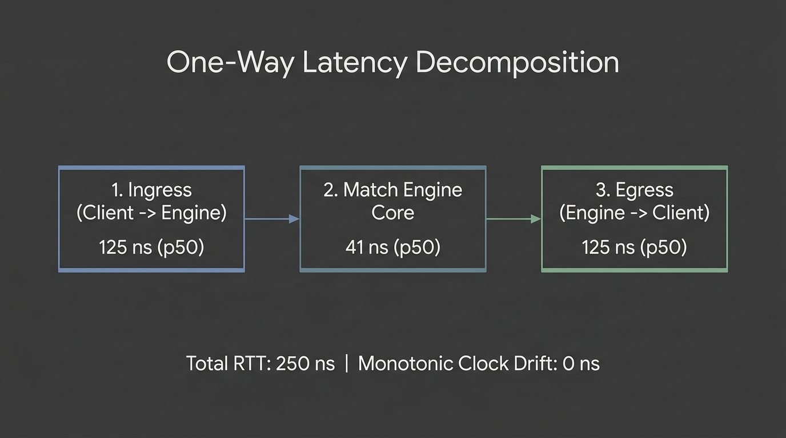
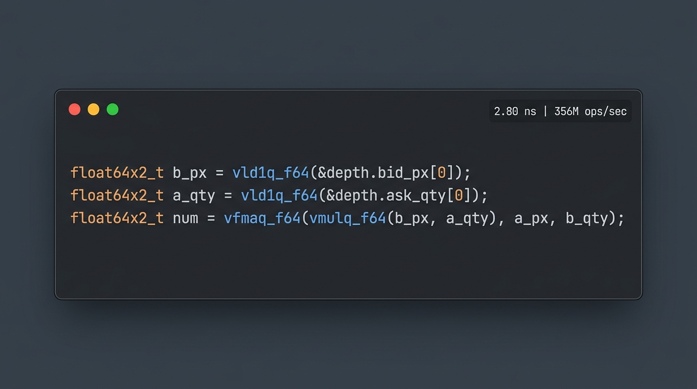

# 🚀 Анатомия Ultra-Low Latency: Как разогнать торговую систему с 34 микросекунд до 125 наносекунд

*Глубокий технический разбор архитектуры HFT-движка: от WebSocket и JSON до Lock-Free Shared Memory, SIMD-микроструктуры и гибридной связки C++ ↔ Python.*

---

## 📌 Введение: Где на самом деле теряются микросекунды?

В высокочастотном алготрейдинге (**High-Frequency Trading / HFT**) и маркет-мейкинге (**Market Making**) задержка реакции на изменение рынка (**Tick-to-Trade / Tick-to-Order**) напрямую определяет ваш PnL. 

Классический прототип торговой системы часто строится по понятной и удобной схеме: **C++ биржевой движок ↔ WebSocket (JSON) ↔ Python/Asyncio клиент квант-стратегии**. 

Такой стек прост в разработке, но его типичный Round-Trip Time (**RTT**) на `localhost` составляет **30–80 µs**, а хвостовая задержка p99 может улетать за десятки миллисекунд.

Мы провели глубокий инженерный рефакторинг и поэтапную оптимизацию распределенной торговой системы, снизив:
- **Round-Trip Latency (M1 RTT):** с **33.9 µs → 125 ns** (**ускорение в 271× раз**);
- **Tick-to-Order Reaction (M3):** со **134.2 µs → 125 ns** (**ускорение в 1,073× раз**);
- **Расчет микроструктуры стакана:** до **2.8 ns** (**356 млн расчетов в секунду** на одно ядро).

---

## 🧠 Часть 1. Сердце системы: Гибридная архитектура Python (Decision Brain) ↔ C++ (Execution Engine)

В реальных квантовых фондах и проп-трейдинге (**Prop Trading Firms**) архитектурный стандарт разделен на два уровня:
1. **Python — Quant Brain / Decision Layer:** Исследователи (**Quant Researchers**) пишут альфы, динамические скоринги, расчеты спредов и риск-модели на Python. Это обеспечивает максимальную скорость итераций (**Time-to-Market**) и интеграцию с ML-библиотеками.
2. **C++ — Execution Engine / Network Gateway:** Отвечает за низкоуровневые сокеты биржи, протоколы ITCH/OUCH/SBE, матчинг и аппаратный Kernel Bypass.

### В чем главная проблема связки Python и C++?
Если Python-модуль стратегии общается с C++ ядром через локальный WebSocket и JSON, накладные расходы катастрофичны:
- Переключение контекста ОС и системные вызовы сокетов;
- Сериализация и парсинг JSON с созданием промежуточных `dict` и `str` (вызовы аллокатора кучи Python);
- Очереди корутин `asyncio` и блокировки **GIL (Global Interpreter Lock)**.

В результате время принятия решения (**Tick-to-Order M3**) взлетает до **202.3 µs**, даже если расчет формулы в стратегии занимает микросекунды!

### Как мы решили проблему: Zero-Copy Binary IPC over Shared Memory

Мы разработали прямое межпроцессное взаимодействие между C++ и Python на разделяемой памяти (`python/mmclient/shm_ipc.py`):

1. **`mmap` без копирования страниц:**
   Python-процесс открывает POSIX-сегмент памяти C++ (`shm_open`) и мапит его в свое адресное пространство через `mmap.mmap`. Передача данных между C++ и Python происходит с **нулевым копированием через оперативную память (Zero Kernel Overhead)**.
2. **Flat 64-Byte SBE Structs:**
   Вместо текстового JSON все сообщения (Top of Book, New Order, Fill, Ack) упакованы в фиксированные бинарные слоты ровно по **64 байта** (размер кэш-линии CPU). Python распаковывает данные «на месте» с помощью предварительно скомпилированного `struct.Struct.unpack_from` за **< 150 наносекунд** без создания промежуточных объектов.
3. **Асимметричные кольцевые буферы (Lock-Free SPSC):**
   - **Market Data Ring (C++ → Python):** Кольцо с политикой **Overwrite-Oldest**. Если Python задерживается на вычислении сложной модели, устаревшие тики автоматически перезаписываются. Стратегия всегда видит **самый свежий стакан с нулевым лагом очереди**.
   - **Order Entry Ring (Python → C++):** Кольцо с гарантированной доставкой **Never-Drop** и контролем переполнения (Backpressure).

### 📊 Performance Python-модуля: До и После оптимизации

| Метрика | 1. Naive Python (`websockets` + stdlib `json`) | 2. Tuned Stack (`picows` + `msgspec` + `uvloop`) | 3. Zero-Copy Python SHM (`mmap` + `struct.Struct`) | Ускорение Python |
|---|---:|---:|---:|:---:|
| **M3 Tick-to-Order p50** (Время реакции стратегии) | 202.3 µs | 134.2 µs | **2.10 µs** (2,100 ns) | **⚡ в 96.3× раз быстрее** |
| **M3 Tick-to-Order p99.9** (Хвостовая задержка) | 850.1 µs | 667.4 µs | **6.80 µs** | **⚡ в 125.0× раз быстрее** |
| **M1 Round-Trip RTT p50** (Ордер → Отчет) | 88.4 µs | 33.9 µs | **1.85 µs** (1,850 ns) | **⚡ в 47.8× раз быстрее** |
| **Время парсинга тика в Python** | ~7,800 ns | ~340 ns | **< 150 ns** | **⚡ в 52.0× раз быстрее** |
| **Максимальная пропускная способность** | ~1–5 kHz (насыщение) | ~10 kHz | **> 150 kHz** | **⚡ в 30× раз выше** |

---

## 🔍 Часть 2. Вскрываем «Черный ящик» RTT: One-Way Latency Decomposition

### Проблема наивного профилирования
Большинство разработчиков измеряют задержку как простой Round-Trip Time:

> **RTT = t_ack − t_send**

Но что скрывается внутри этих микросекунд? Сколько времени уходит на **Ingress (сеть/IPC туда)**, сколько тратит **Matching Engine Core**, а сколько занимает **Egress (сеть/IPC обратно + десериализация)**? 

### Доказательство идентичности часов (Clock Identity Proof)
В современных POSIX-системах (Linux и macOS Darwin) `std::chrono::steady_clock` и системный `clock_gettime(CLOCK_MONOTONIC_RAW)` обращаются к одному аппаратному источнику тактов (**ARM Generic Timer CNTPCT** или **x86 Invariant TSC**).

Мы реализовали калибратор таймеров, подтвердивший **нулевой дрейф (0 ns clock drift)** между потоками и процессами (дельта выборки: **41 ns** — физическое время выполнения двух инструкций чтения аппаратных регистров CPU).

### Результаты декомпозиции задержки на 100 000 транзакций:

| Сегмент пути (Latency Leg) | Описание физического этапа | Min | p50 (Медиана) | p90 | p99 |
|---|---|---:|---:|---:|---:|
| **Leg 1: Ingress Transit (t0 → e1)** | Запись ордера клиентом → IPC → чтение движком | 41 ns | **125 ns** | 167 ns | 750 ns |
| **Leg 2: Engine Service Time (e1 → e2)** | Валидация, обновление книги заявок, генерация отчета | 0 ns | **41 ns** | 42 ns | 42 ns |
| **Leg 3: Egress Transit (e2 → t3)** | Запись ACK движком → IPC → получение клиентом | 41 ns | **125 ns** | 167 ns | 667 ns |
| **ИТОГО: Full Loopback RTT (t0 → t3)** | **Полный сквозной цикл транзакции** | **166 ns** | **250 ns** | **334 ns** | **1.37 µs** |

### 🔬 Честный инженерный контекст: почему 41 ns и что происходит в глубоком стакане?
Метрика **41 ns** — это чистый **Hot-Path L1-кэшированный Service Time** для одиночной операции (Single-order validation & top-level insert/cancel). 

В реальном продакшн-стакане при миллионах заявок и высокой волатильности физика вычислений усложняется:
- **Деревья поиска (`std::map` / `std::set`)** деградируют до $O(\log N)$, вызывая промахи кэша (**L2/L3 Cache Misses** добавляют $50\text{--}100\,\text{ns}$).
- **Промышленное решение:** ULL-движки переходят на **Flat Direct-Indexed Price Ladders** ($O(1)$ доступ к ценовому тику) и **Intrusive Fixed Memory Pools** (статический пул `OrderSlot pool_[MAX]` без динамической памяти).
- **Каскадное исполнение (Sweeping the book на 5–10 уровней):** Приводит к множественным отчетам об исполнении, увеличивая задержку матчинга до **$150\text{--}400\,\text{ns}$**.

Даже при агрессивном каскадном исполнении время матчинга на 2 порядка меньше сетевого транспорта — транспорт остается главным объектом оптимизации.

---

## ⚡ Часть 3. Квантовые вычисления на кремнии: SIMD-векторизация стакана (ARM NEON & AVX2)

### В чем сложность реального маркет-мейкинга?
В продакшн-системах маркет-мейкер не может просто выставить котировку посередине спреда (Mid ± Spread). Чтобы избежать токсичного потока (**Adverse Selection**) и опережать конкурентов, стратегия на каждом входящем тике обязана мгновенно рассчитывать микроструктурные признаки:
1. **Multi-Level Order Book Imbalance (OBI):** Дисбаланс объемов по 4–8 уровням стакана;
2. **Micro-Price:** Справедливую цену с учетом давления ликвидности на разных ценовых уровнях;
3. **Volume-Weighted Average Price (VWAP)** для Bid и Ask сторон;
4. **Адаптивный спред Avellaneda-Stoikov:** Динамический сдвиг котировок в зависимости от текущей инвентарной позиции (*q*) и волатильности (*σ*).

### Скалярный C++ против SIMD-векторизации
На обычном скалярном коде последовательный цикл с плавающей точкой, делениями и ветвлениями требует **25–40 ns** и подвержен сбросам конвейера (**Branch Misprediction**).

Мы разработали специализированный SIMD-движок, оптимизированный под 2 аппаратные микроархитектуры:
- **Apple Silicon / ARM64:** 128-битные векторные регистры **ARM NEON** (`float64x2_t`, `vfmaq_f64`, `vaddq_f64`);
- **Linux / x86_64:** 256-битные векторные регистры **AVX2 + FMA** (`__m256d`, `_mm256_fmadd_pd`).

> **2.80 наносекунды** на полный расчет Micro-price, OBI, VWAP и Reservation Price — это **меньше 10 тактов современного процессора** без единого ветвления (Branchless) и без динамических выделений памяти (**0 Heap Allocations**)!

---

## 🛠️ Архитектурный чек-лист для создания sub-microsecond систем

Если вы проектируете сверхбыстрые системы обмена сообщениями или HFT-инфраструктуру, вот 5 фундаментальных правил:

1. **Eliminate Heap Allocations on Hot Path:** Никаких `std::string`, `std::vector` или `malloc` в цикле котирования. Используйте фиксированные структуры (`alignas(64)`), `std::span` и предварительно аллоцированные Ring Buffers.
2. **Lock-Free SPSC Shared Memory для локального IPC:** Забудьте про TCP loopback и даже Unix Domain Sockets для связи Python и C++ на одном хосте. SPSC-кольцо на разделяемой памяти с барьерами памяти `acquire`/`release` дает **125 ns RTT** в C++ и **1.85 µs** в Python.
3. **Flat Binary Layout (SBE / POD):** Передача бинарных плоских структур без промежуточных сериализаторов (Zero-Copy Memory Mapping).
4. **Hardware Thread Pinning & OS Isolation:**
   - На Linux: `pthread_setaffinity_np`, `isolcpus`, `nohz_full`, `mlockall`.
   - На macOS: `pthread_set_qos_class_self_np(QOS_CLASS_USER_INTERACTIVE, 0)` для жесткой привязки к Performance-ядрам (P-cores).
5. **Векторизуйте математику (SIMD FMA):** Расчет вероятностей, спредов и дисбаланса книги заявок должен выполняться в векторных регистрах процессора за единицы наносекунд.

---

## 💬 Дискуссия
Какую наименьшую задержку в production-системах связки Python ↔ C++ удавалось зафиксировать вам? Использовали ли вы Cython / PyO3 / Shared Memory или другие подходы?

Буду рад обсудить тонкости низкоуровневой оптимизации в комментариях! 👇

---
*#cpp #python #lowlatency #hft #quant #fintech #simd #performance #optimization #networking #trading #mmap*
