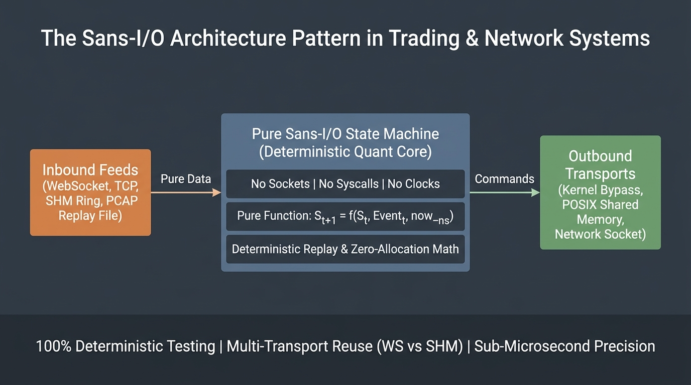

# 🏛️ The Sans-I/O State Machine Pattern in Quantitative Trading & High-Frequency Systems

*A comprehensive architectural deep dive into the Sans-I/O (Sans-Input/Output) design pattern: why low-latency trading engines and critical network protocols must eliminate sockets, timers, and asynchronous calls from their decision core.*

---

## 📌 Introduction: The Anatomy of a Trading System Failure

Most developers building their first algorithmic trading client or networking engine make a fundamental architectural mistake: **they entangle business decision logic with network I/O, event loops, and OS system calls**.

A typical implementation looks like this:

```python
# ❌ Classic Anti-Pattern: Business logic tightly coupled to sockets and system time
async def on_market_tick(ws, tick):
    if time.time() - last_order_time > 1.0:
        if tick.bid_price > current_quote:
            await ws.send_json({"type": "cancel", "id": active_order_id})
            await ws.send_json({"type": "new_order", "price": tick.bid_price})
```

While seemingly straightforward, this pattern leads to severe production vulnerabilities:
1. **Unpredictable Concurrency Bugs (Heisenbugs):** While the coroutine pauses at `await ws.send_json()`, an execution report (Fill) or market-data book update arrives on the socket. Order state becomes desynchronized, leading to duplicate orders and orphaned live quotes.
2. **Brittle & Slow Testing:** Testing the strategy requires spawning mock servers on local TCP ports, managing ephemeral sockets, and inserting arbitrary `asyncio.sleep()` delays. Tests take minutes to run and flake under CI scheduler contention.
3. **Transport Lock-in:** Migrating from WebSocket to Unix Domain Sockets, Kernel-Bypass DPDK, or Lock-Free Shared Memory requires **rewriting the entire strategy from scratch** because network calls and `time.time()` are scattered across the codebase.
4. **Impossible Deterministic Replay:** When a bug occurs during live market volatility, it cannot be reproduced offline: internal calls to `time.time()` yield different values during replay.

The solution to all four failure modes is the **Sans-I/O (Sans-Input/Output State Machine)** architecture pattern.



---

## 💡 What is Sans-I/O?

The term **Sans-I/O** (from French *sans* — "without") originated in the high-performance network protocol community (projects like `quiche`, `h11`, `wsproto`).

> **Fundamental Rule of Sans-I/O:**
> The protocol engine and trading decision core must be designed as a **pure deterministic state machine**. It contains **NO sockets, NO file descriptors, NO system clocks, NO threads, and NO `await` / `async` keywords**.

### 📐 Canonical Mathematical Model (Mealy State Machine / Finite State Transducer)

In formal automata theory, a Sans-I/O strategy is a deterministic finite-state transducer where state transitions and command generation are mathematically pure:

$$
(S_{t+1}, \mathbf{C}_t) = \delta(S_t, E_t, \tau_t)
$$

where:
- $S_t \in \mathcal{S}$ is the current internal state of the strategy (live orders, inventory, risk limits, quote cache);
- $E_t \in \mathcal{E}$ is an incoming discrete event ($\mathrm{Top\text{-}of\text{-}Book}$, $\mathrm{OrderAck}$, $\mathrm{Fill}$, $\mathrm{TimerTick}$);
- $\tau_t \in \mathbb{N}$ is a monotonic timestamp ($\mathrm{now\_ns}$) supplied explicitly by the caller;
- $\mathbf{C}_t \subseteq \mathcal{C}$ is an ordered sequence of outbound commands ($\mathrm{NewOrder}$, $\mathrm{CancelOrder}$, $\mathrm{StopQuoting}$);
- $S_{t+1} \in \mathcal{S}$ is the updated strategy state.

---

## 🏗️ Separation of Concerns: WHAT vs HOW

In a Sans-I/O architecture, the system is strictly bifurcated into two isolated layers:

| Layer | Responsibility | Project Implementation | Core Contents |
|---|---|---|---|
| **State Machine Core** | Defines **WHAT** to do | [`python/mmclient/strategy.py`](../python/mmclient/strategy.py), [`NativeMarketMaker`](../cpp/include/mm/strategy_native.hpp) | Price calculation, inventory skew, order lifecycle, sequence monotonicity checks |
| **Transport Adapters** | Defines **HOW** to transport | [`ws_picows.py`](../python/mmclient/ws_picows.py), [`shm_ipc.py`](../python/mmclient/shm_ipc.py) | Sockets, `asyncio`, `uvloop`, `epoll`, POSIX `mmap`, JSON/SBE serialization |

---

## 🔍 Codebase Implementation Breakdown

Let us inspect the market-making strategy implementation in [`python/mmclient/strategy.py`](../python/mmclient/strategy.py).

### 1. Explicit Order State Enum
Instead of tracking loose boolean flags (`is_pending`, `is_cancelled`), order lifecycle is governed by an explicit state machine:

```python
class OState(Enum):
    PENDING_NEW = auto()     # Order sent to venue, awaiting ACK
    LIVE = auto()            # Confirmed on book, active quote
    PENDING_CANCEL = auto()  # Cancel request sent, awaiting CancelAck
```
> An order in `PENDING_NEW` or `PENDING_CANCEL` locks the quoting slot, preventing the strategy from firing duplicate orders during network lag.

### 2. Pure Market Data Processing (`on_tob`)
The [`on_tob`](../python/mmclient/strategy.py#L215) handler accepts book state and a nanosecond timestamp:

```python
def on_tob(self, tob: Tob, now_ns: int) -> list[Cmd]:
    # 1. Monotonicity verification
    if tob.md_seq < self._md_seq:
        return [StopQuoting(f"md_seq decreased: {self._md_seq} -> {tob.md_seq}")]
    
    self._last_tob_ns = now_ns
    if tob.md_seq == self._md_seq:
        return []  # Unchanged book: response is silence

    self._md_seq = tob.md_seq
    self._bid_px = tob.bid_px
    self._ask_px = tob.ask_px

    # 2. Pure command generation
    return [
        *self._quote(_BID, tob.bid_px, tob.ask_px, tob.bid_px, tob.md_seq),
        *self._quote(_ASK, tob.ask_px, tob.ask_px, tob.bid_px, tob.md_seq),
    ]
```

Key observations:
- **Zero I/O side effects:** No network calls, socket writes, or asynchronous suspensions occur inside `on_tob`.
- **Pure command output:** The method returns `list[Cmd]`. The caller/adapter handles physical transmission.

### 3. Pure Stale-Feed Detection (`on_timer`)
Feed stall detection without OS timer binding via [`on_timer`](../python/mmclient/strategy.py#L173):

```python
def on_timer(self, now_ns: int) -> list[Cmd]:
    if self._swept or self._last_tob_ns is None:
        return []
    
    age = now_ns - self._last_tob_ns
    if age <= self.stale_ns:
        return []

    # Feed stalled: trip safety circuit, cancel all resting orders
    self._stopped = True
    self._swept = True
    resting = [o for o in self._orders.values() if o.state in (OState.PENDING_NEW, OState.LIVE)]
    return [
        StopQuoting(f"stale feed: {age} ns since last book"),
        *[SendCmd(CancelOrder(cl_id=o.cl_id)) for o in resting]
    ]
```

---

## 🚀 Key Advantages in Production

### 1. ⚡ Ultra-Fast Deterministic Testing (586 Tests in 3.49 Seconds)
Because the strategy has no socket or real-time dependencies:
- Tests pass millions of synthetic ticks in a simple `for` loop;
- Complex failure modes (fill before ack, missing sequence numbers, crossed books, 10-second feed freezes) are simulated instantaneously;
- **All 586 unit and integration tests execute in 3.49 seconds with 100% line and branch coverage**.

### 2. 🔄 Seamless Transport Swapping: WebSocket to Zero-Copy Shared Memory
The **exact same Python `Strategy` class** powers two completely different transport adapters:
1. **WebSocket Adapter ([`ws_picows.py`](../python/mmclient/ws_picows.py)):** Parses JSON from network frames and invokes `strategy.on_tob(tob, now_ns)`.
2. **Zero-Copy SHM IPC Adapter ([`shm_ipc.py`](../python/mmclient/shm_ipc.py)):** Deserializes 64-byte flat SBE structs from `mmap` rings and invokes the same `strategy.on_tob(tob, now_ns)`.
> Not a single line of quant trading logic changed, while round-trip latency dropped from **202.3 µs to 2.10 µs ($96.3\times$ speedup)**.

### 3. ⏱️ 100% Deterministic Replay & Time-Travel Debugging
When market anomalies occur in production, replaying the exact sequence of historical market data and execution reports into `Strategy` reproduces the internal state and generated decisions bit-for-bit.

### 4. 🛡️ Complete Elimination of Race Conditions
All strategy logic executes synchronously on a single thread. No mutexes, lock contention, or asynchronous coroutine interleaved races can corrupt order state.

---

## 📋 Sans-I/O Verification Checklist

- [x] Zero imports of `socket`, `asyncio`, `websockets`, `aiohttp`, or `requests` in the strategy module.
- [x] Zero `await` keywords or blocking socket write calls.
- [x] Zero unparameterized clock queries (`time.time()`, `time.monotonic()`); timestamp is always an input argument.
- [x] Methods return immutable command objects rather than triggering network side effects.
- [x] 100% of the strategy can be tested without opening network ports or running mock servers.

---
*Reference Implementation: [Market Maker Prototype](https://github.com/Dmdv/market-maker-proto)*
