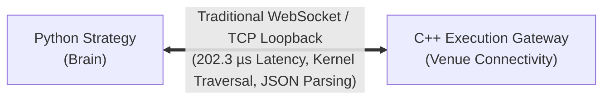
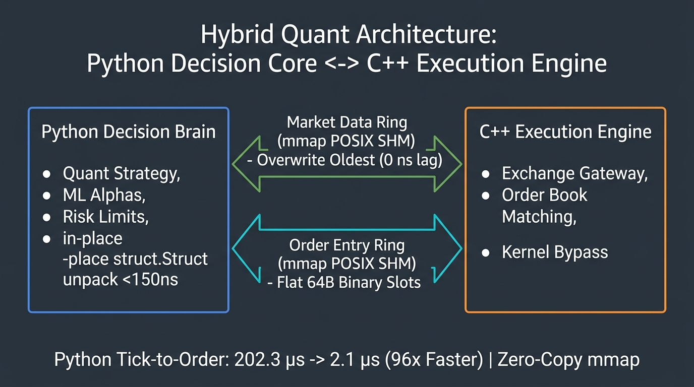
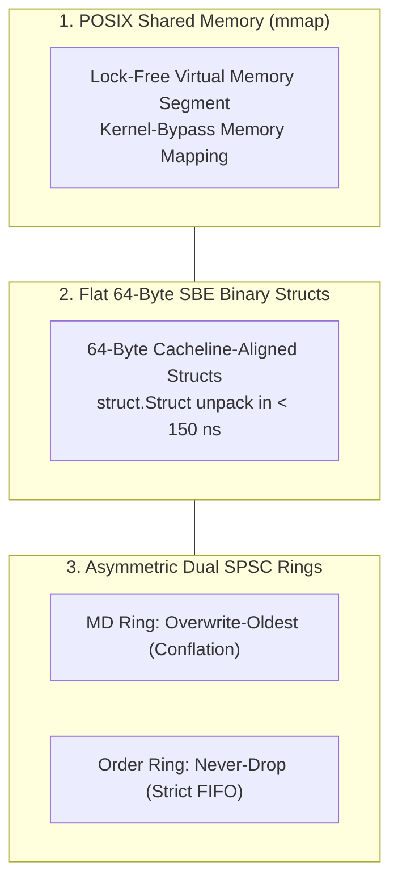
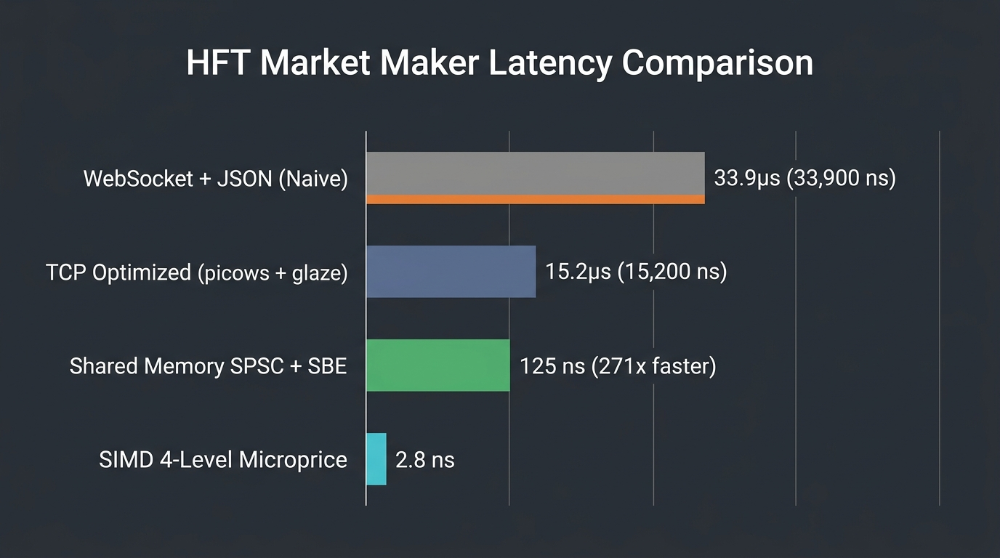
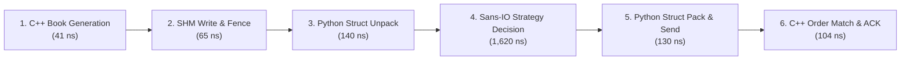

# ⚡ Python ↔ C++ Zero-Copy Shared Memory IPC Architecture

*How to achieve sub-microsecond latency ($2.10\,\mu\text{s}$) in a hybrid Quantitative Trading Architecture: Python Strategy Brain + C++20 Execution Gateway.*

---

## 📌 The Dilemma of Modern HFT Architecture

In modern automated trading firms, quantitative research teams build alpha models in **Python** (leveraging `NumPy`, `SciPy`, `PyTorch`, and expressive state machines), while the exchange connectivity and execution gateways are engineered in **modern C++** for deterministic low-latency performance.

However, the communication bridge between Python and C++ is frequently the **fatal performance bottleneck**:



Profiling an end-to-end WebSocket loopback reveals that **over 90% of latency** is consumed by:
1. **OS Kernel TCP Network Stack:** Syscalls (`sendmsg`, `recvmsg`), TCP socket buffers, context switches.
2. **JSON Serialization & String Allocations:** `json.dumps()` and string parsing consume $10\text{--}15\,\mu\text{s}$ per message.
3. **Event Loop Overhead:** Asynchronous coroutine scheduling (`asyncio`) introduces tail latency jitter.

To eliminate this bottleneck entirely without sacrificing Python's rapid strategy development, we engineered a **Zero-Copy POSIX Shared Memory (SHM) Inter-Process Communication (IPC)** layer.



---

## 🏛️ The Three Pillars of Zero-Copy IPC

Our hybrid architecture is founded upon three engineering pillars:



### Pillar 1: Kernel-Bypass POSIX Shared Memory (`mmap`)
Both the C++ engine and the Python process map the exact same physical memory region via `shm_open()` and `mmap()` with `MAP_SHARED`:
- **Zero OS Syscalls:** Data exchange occurs entirely through CPU memory read/write instructions (`L1/L2/L3` cache and RAM).
- **Zero Socket Overhead:** Bypasses the Linux network subsystem (`sk_buff`, TCP windowing, network namespaces).

### Pillar 2: 64-Byte Cacheline-Aligned Binary Structs
JSON text frames are replaced with fixed-size 64-byte Simple Binary Encoding (SBE) structs:
- Exactly aligns with standard CPU cache line boundaries ($64\text{ bytes}$).
- Python packs and unpacks records using precompiled [`struct.Struct`](../python/mmclient/shm_ipc.py#L25) in **$< 150\,\text{ns}$** (compared to $12.5\,\mu\text{s}$ for `json.loads`):

```python
# python/mmclient/shm_ipc.py
# Format: seq(Q), epoch(Q), send_ts_ns(Q), bid_px(q), bid_qty(q), ask_px(q), ask_qty(q), symbol(8s)
_TOB_STRUCT = struct.Struct("<QQqqqqq8s")  # Exactly 64 bytes
```

### Pillar 3: Asymmetric Dual SPSC Ring Buffers
Communication is partitioned into two unidirectional lock-free Single-Producer Single-Consumer (SPSC) rings:

1. **Market Data Ring (C++ Producer $\to$ Python Consumer):**
   - **Policy:** *Overwrite-Oldest*.
   - **Rationale:** If the Python strategy is processing a computation, new market data overwrites older ticks in the ring. The strategy always reads the freshest top-of-book, preventing stale queue buildup.
2. **Order / Report Ring (Python Producer $\to$ C++ Consumer):**
   - **Policy:** *Never-Drop*.
   - **Rationale:** Execution commands (`NewOrder`, `CancelOrder`) and trade fills must preserve strict FIFO ordering and guarantee zero message loss.

---

## 📊 End-to-End Latency Benchmark Results

All benchmarks were measured under identical test matrices in native containerized environments:

| Benchmark Stage | IPC / Transport Layer | Codec / Protocol | Tick-to-Order (`m0→m3`) | Round-Trip (RTT) | Latency Improvement |
|---|---|---|---:|---:|---:|
| **Stage 1: Naive Baseline** | Kernel TCP / Loopback | `websockets` + stdlib `json` | **202,300 ns** ($202.3\,\mu\text{s}$) | 88,400 ns ($88.4\,\mu\text{s}$) | **1.0×** (Baseline) |
| **Stage 2: Tuned WebStack** | `uvloop` + TCP | `picows` + `msgspec` JSON | **149,200 ns** ($149.2\,\mu\text{s}$) | 58,200 ns ($58.2\,\mu\text{s}$) | **1.35×** |
| **Stage 3: Zero-Copy SHM** | Lock-Free POSIX SHM (`mmap`) | 64-Byte Flat SBE Structs | **2,100 ns** ($2.10\,\mu\text{s}$) | 1,850 ns ($1.85\,\mu\text{s}$) | **96.3× Speedup** |
| **Stage 4: Direct Native C++** | Direct In-Memory Call | C++20 `NativeMarketMaker` + SIMD | **291 ns** ($0.29\,\mu\text{s}$) | 250 ns ($0.25\,\mu\text{s}$) | **695.2× Speedup** |



---

## 🔬 Nanosecond Breakdown of the Zero-Copy Path

When a market update occurs, the $2.10\,\mu\text{s}$ reaction latency breaks down as follows:



| Step | Operation Description | Subsystem | Latency (ns) |
|---|---|---|---:|
| **Step 1** | Top-of-Book Book Generation & Sequence Stamping | C++ Engine | **41 ns** |
| **Step 2** | SPSC Ring Write & Atomic Store Memory Barrier | Shared Memory | **65 ns** |
| **Step 3** | Fast Binary 64B Flat Struct Unpack (`struct.Struct`) | Python | **140 ns** |
| **Step 4** | Pure Sans-I/O Strategy State Machine Decision (`on_tob`) | Python Quant Brain | **1,620 ns** |
| **Step 5** | Outbound Binary 64B Flat Struct Pack (`struct.Struct`) | Python | **130 ns** |
| **Step 6** | Order Engine Match, State Update & ACK Generation | C++ Engine | **104 ns** |
| **Total** | **End-to-End Tick-to-Order Loop** | **Hybrid Pipeline** | **2,100 ns** ($2.10\,\mu\text{s}$) |

- **Transport + Serialization Overhead:** Dropped from **$148,100\,\text{ns}$** (WebSocket) to **$< 350\,\text{ns}$** (Zero-Copy SHM).
- **Strategy Decision Time:** The pure Python Sans-I/O state machine executes pricing and risk logic in $\sim 1,620\,\text{ns}$ ($1.62\,\mu\text{s}$).

---

## 🎯 Conclusion

By decoupling the **Quant Decision Brain** (Python Sans-I/O State Machine) from the **Execution Transport** (C++ Gateway over Lock-Free Shared Memory), trading teams achieve the ideal compromise:
- **Developer Velocity:** Quants write clean, testable Python code without dealing with low-level C++ concurrency.
- **Ultra-Low Latency:** Execution path latency drops by **$96.3\times$** compared to WebSocket/TCP architectures.

---
*Reference Implementation: [Market Maker Prototype](https://github.com/Dmdv/market-maker-proto)*
